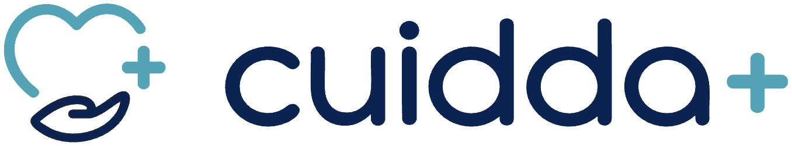

<p align="center">
  
</p>

<h1 align="center">Ecosistema de automatización IA autónomo</h1>

<p align="center">
  Solicitud de cuidado entrante → calificación con IA sobre la base de datos → validación humana → salida multicanal
</p>

<p align="center">
  <a href="https://rubenvg11.github.io/cuidda-ecosistema-automatizacion-ia/"><b>Panel de control en vivo</b></a> ·
  <a href="Cuidda-Entrega-Final.pdf"><b>Informe completo (PDF)</b></a>
</p>

---

## Qué es esto

**Cuidda** conecta familias con personal de salud verificado a domicilio en Trujillo, Perú. Este repositorio contiene el ecosistema de automatización que procesa las solicitudes de cuidado que llegan por correo: las lee, las clasifica contra la cobertura y el catálogo de turnos reales, arma una propuesta apoyada en una base de conocimiento, y **no le escribe a nadie hasta que una persona la aprueba**.

Es la entrega final del curso de automatización, pero está construido sobre datos y reglas reales de Cuidda, no sobre un ejemplo inventado.

## El stack

| Capa | Herramienta |
|---|---|
| Orquestador | **Make** · zona `us2` · 2 escenarios |
| Base de datos y memoria | **Airtable** · base `Cuidda · Operaciones`, 6 tablas relacionadas |
| Procesamiento IA | **Claude Haiku 4.5** en los dos módulos, vía Make AI Toolkit — el clasificador arrancó en el modelo barato y el test de estrés lo descartó ([por qué](docs/03-optimizacion-de-costos.md)) |
| Canal de salida | **Gmail** (a la familia, en el hilo original) + **Slack** (aprobación humana y alertas) |

## Cómo funciona

### Escenario 1 · Ingesta y calificación IA — 28 módulos, 3 rutas

Un correo entra por Gmail. El flujo lee la configuración, **los distritos con cobertura** (`{Cubierto} = "Si"`, filtrado por la base, no por la IA) y el catálogo de turnos desde Airtable, se los inyecta al clasificador, y rutea con una expresión que se calcula sobre los campos extraídos —**la ruta no la decide el modelo**:

- **A · Dato faltante** → registra en `Log de errores`, avisa por Slack, corta. No gasta el modelo caro.
- **B · Fuera de cobertura** → crea la solicitud como `Rechazado` y responde amablemente a la familia.
- **C · Solicitud válida** → lee la base de conocimiento, redacta la propuesta con Claude Haiku 4.5, crea la solicitud vinculada y pide aprobación en Slack.

### Escenario 2 · Envío tras aprobación humana — 13 módulos, 2 rutas

Se dispara **solo** cuando alguien marcó `Aprobado por Humano` y puso el estado en `Aprobado`. Verifica que la propuesta no esté vacía, envía el correo en el hilo original de la familia, cierra el ciclo con `Estado = Enviado` y confirma en el hilo de Slack.

Ese `Estado = Enviado` es lo que **corta el loop infinito**: el registro deja de cumplir la fórmula del trigger y no puede volver a entrar.

## Qué hay en cada carpeta

| Carpeta | Contenido |
|---|---|
| [`docs/`](docs/) | El PDF de la entrega y los cinco criterios en markdown |
| [`blueprints/`](blueprints/) | Los dos `.json` de Make, completos y sin fragmentar. Se importan con *Import blueprint* |
| [`schemas/`](schemas/) | Los 6 esquemas JSON de transferencia entre nodos (JSON Schema 2020-12) |
| [`evidencias/`](evidencias/) | Mapa de arquitectura y capturas del test de estrés |
| [`herramientas/`](herramientas/) | Los scripts que **generan** los blueprints y el diagrama |

## Los cinco criterios

| # | Criterio | Dónde |
|---|---|---|
| 1 | Mapa de arquitectura | [`docs/01-mapa-de-arquitectura.md`](docs/01-mapa-de-arquitectura.md) |
| 2 | Estructuras de datos + esquemas JSON | [`docs/02-estructuras-de-datos.md`](docs/02-estructuras-de-datos.md) · [`schemas/`](schemas/) |
| 3 | Optimización de costos | [`docs/03-optimizacion-de-costos.md`](docs/03-optimizacion-de-costos.md) |
| 4 | Seguridad y resiliencia | [`docs/04-seguridad-y-resiliencia.md`](docs/04-seguridad-y-resiliencia.md) |
| 5 | Dashboard de control | [`docs/05-dashboard-de-control.md`](docs/05-dashboard-de-control.md) · [**panel en vivo**](https://rubenvg11.github.io/cuidda-ecosistema-automatizacion-ia/) |

## Reproducirlo

Los blueprints y el diagrama no están hechos a mano: se generan.

```bash
# los dos blueprints de Make
python herramientas/build.py

# el mapa de arquitectura (svg + png)
pip install cairosvg
python herramientas/diagrama.py
```

Para levantarlo en tu propio Make: crear un escenario nuevo → menú `⋯` → **Import blueprint** → subir el `.json`. Hay que volver a apuntar las cuatro conexiones (Airtable, Gmail, Slack, Make AI) a las tuyas, porque los ids de conexión del blueprint son de esta cuenta.

## Sobre las credenciales

Los blueprints contienen **ids numéricos de conexión de Make**, no secretos. Las cuatro integraciones usan OAuth gestionado por Make; ninguna API key vive dentro del flujo ni de este repositorio.
