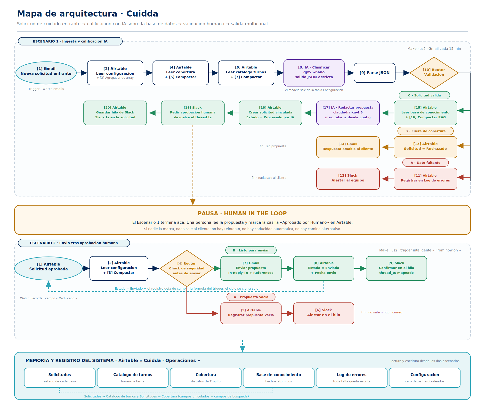

# Criterio 1 · Mapa de arquitectura



El diagrama completo está en [`evidencias/arquitectura-cuidda.png`](../evidencias/arquitectura-cuidda.png) y en [`evidencias/arquitectura-cuidda.svg`](../evidencias/arquitectura-cuidda.svg) (vectorial, para hacer zoom sin perder nitidez).

## Lectura del flujo

### Escenario 1 · Ingesta y calificación IA — `6339635`

**Trigger.** `[1] Gmail · Nueva solicitud entrante` observa la bandeja con el filtro `is:unread subject:(solicitud de cuidado)` y arranca en **From now on**: Make guarda la marca de tiempo del arranque y nunca procesa correo viejo. Un correo leído queda marcado como visto (`markSeen`), así que no puede volver a entrar.

**Carga de contexto (3 lecturas + 3 agregadores).** Antes de llamar a la IA, el flujo lee de Airtable la configuración del sistema `[2]`, los distritos con cobertura `[4]` y el catálogo de turnos `[6]`, y los compacta `[3] [5] [7]`. Esto es lo que hace que el prompt sea dinámico: si mañana Cuidda abre un distrito nuevo o cambia una tarifa, el prompt cambia solo.

**La regla de negocio no la evalúa la IA.** El módulo `[4]` no lee la tabla `Cobertura` entera: la lee con la fórmula `{Cubierto} = "Si"`. El prompt recibe una lista que **ya está filtrada por la base de datos**, y la única pregunta que le queda a la IA es *"¿el lugar que escribió esta familia está en esta lista?"*. Esto no es un detalle de implementación: es la diferencia entre pedirle a un modelo barato que lea una columna `Si/No` por línea —que es donde se equivocaba en las pruebas— y pedirle que haga coincidir un nombre contra un listado. La regla de quién tiene cobertura vive en Airtable, donde se puede auditar y cambiar sin tocar un prompt.

**Motor de IA `[8]`.** `gpt-5-nano` recibe el correo junto con la cobertura y el catálogo reales, y devuelve un JSON de 12 claves. (Sobre el identificador del modelo, ver el criterio 3: la intención era leerlo de `Configuracion` y Make no lo permite en ese campo.)

**Parseo y ruteo `[9]` `[10]`.** El JSON se parsea y el router decide leyendo solo dos banderas: `datos_completos` y `distrito_cubierto`.

| Ruta | Condición | Qué hace |
|---|---|---|
| **A · Dato faltante** | `datos_completos = "no"` | `[11]` registra en `Log de errores` con la lista de lo que faltó · `[12]` avisa por Slack. No se crea solicitud y no se gasta el modelo caro. |
| **B · Fuera de cobertura** | `datos_completos = "si"` y `distrito_cubierto = "no"` | `[13]` crea la solicitud como `Rechazado` con el motivo · `[14]` responde a la familia por Gmail, en el mismo hilo, nombrando el lugar tal como ella lo escribió (`distrito_mencionado`). Sin propuesta: no tiene sentido redactar algo que no se puede cumplir. |
| **C · Solicitud válida** | `datos_completos = "si"` y `distrito_cubierto = "si"` | `[15]` lee la base de conocimiento (RAG) · `[16]` la compacta · `[17]` Claude Haiku 4.5 redacta la propuesta · `[18]` crea la solicitud vinculada a Cobertura y a Catálogo de turnos · `[19]` pide aprobación en Slack · `[20]` guarda el `ts` de ese mensaje para poder responder en el hilo. |

**Pausa.** El Escenario 1 termina en `[19]`/`[20]`. No hay rama que envíe nada a la familia por su cuenta.

### Escenario 2 · Envío tras aprobación humana — `6339727`

**Trigger.** `[1] Airtable · Solicitud aprobada por un humano` observa la tabla `Solicitudes` por el campo `Modificado` (*Last modified time*) con la fórmula `AND({Aprobado por Humano} = 1, {Estado} = "Aprobado")`, también en **From now on**. Un registro que nadie aprobó nunca entra al flujo.

**Router de seguridad `[4]`.** Antes de tocar el exterior, se verifica que la propuesta no esté vacía.

| Ruta | Condición | Qué hace |
|---|---|---|
| **A · Propuesta vacía** | `length(trim(Propuesta generada)) = 0` | `[5]` registra el caso · `[6]` avisa en el hilo de Slack. **No sale ningún correo.** |
| **B · Listo para enviar** | la propuesta tiene contenido | `[7]` envía por Gmail con `In-Reply-To` y `References` para caer en el hilo original · `[8]` cierra el ciclo con `Estado = Enviado` y `Fecha envio` · `[9]` confirma en el hilo de Slack. |

**Corte del loop.** `[8]` modifica el registro, lo que vuelve a tocar el campo `Modificado` y lo devuelve al trigger — pero ya no cumple la fórmula, porque `Estado` dejó de ser `"Aprobado"`. El ciclo se cierra por construcción, no por un contador ni un delay.

## Nombres de nodo

Todos los módulos llevan el nombre con el que aparecen en el diagrama (`metadata.designer.name` en el blueprint), con el mismo numeral. Un error registrado en `Log de errores` dice, por ejemplo, `[17] IA Redactar propuesta`: se ubica en el mapa sin adivinar.

## Reproducir el diagrama

El mapa no es una imagen dibujada a mano: lo genera [`herramientas/diagrama.py`](../herramientas/diagrama.py), que escribe el SVG y lo rasteriza con `cairosvg`. Cambiar el flujo y volver a correr el script mantiene el diagrama sincronizado.

```bash
pip install cairosvg
python herramientas/diagrama.py
```
